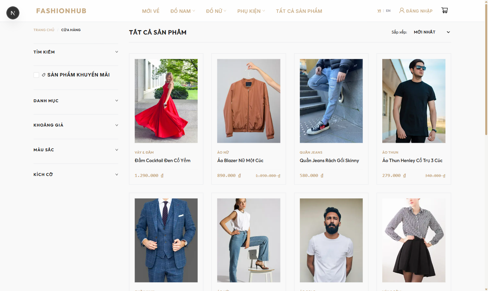
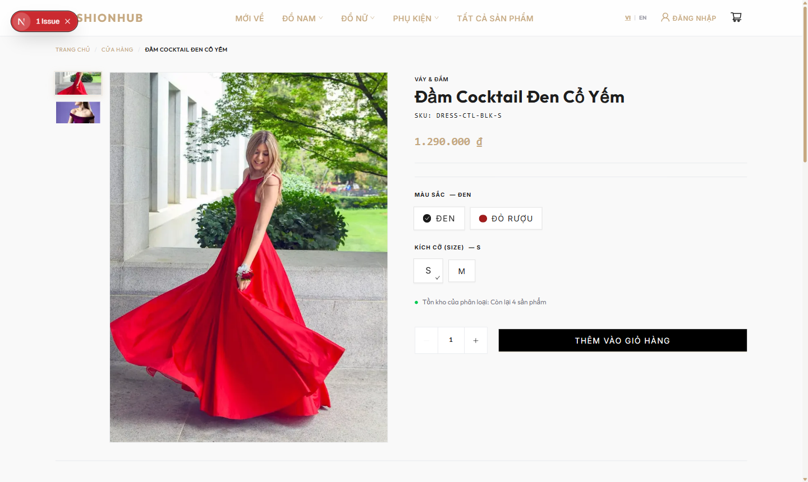
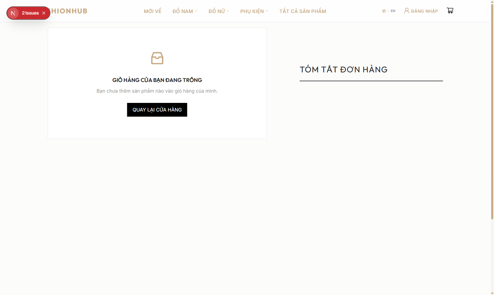
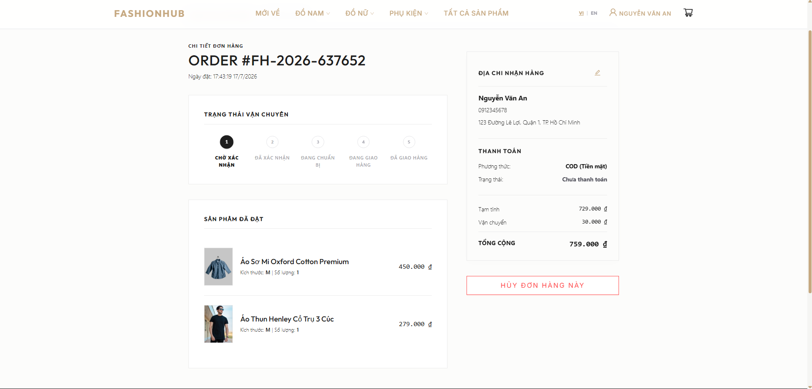
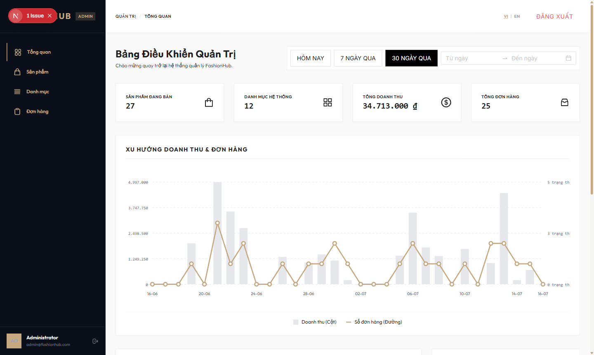
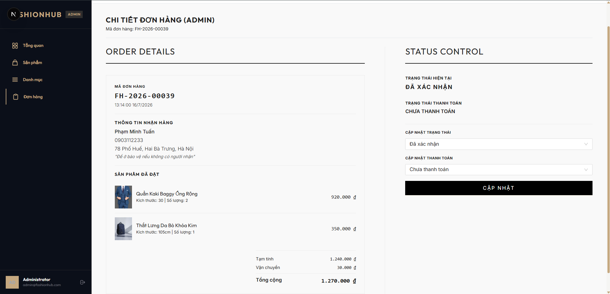

# 🌟 FashionHub - Dự án Cửa Hàng Thời Trang Bán Quần Áo Cao Cấp

Chào mừng bạn đến với **FashionHub**, một hệ thống e-commerce thời trang được thiết kế với phong cách editorial sang trọng, tối giản lấy cảm hứng từ các tạp chí thời trang cao cấp. Dự án sử dụng cấu trúc **Monolith + Separated Frontend** với phần Backend NestJS và Frontend Next.js hoạt động độc lập và giao tiếp mượt mà qua RESTful API.

---

## 📐 1. Kiến Trúc & Công Nghệ Sử Dụng

Dự án được chia làm hai phần chính: **Backend** (NestJS) và **Frontend** (Next.js), kết nối với cơ sở dữ liệu PostgreSQL.

### 🖥️ Frontend (Client & Admin Panel)
*   **Framework:** Next.js (v16.2.10, App Router, React 19)
*   **Giao diện:** Ant Design (antd) + Tailwind CSS (v4)
*   **Quản lý trạng thái:**
    *   **Zustand:** Dành cho Client State (Auth, Cart, Trạng thái UI).
    *   **TanStack React Query:** Dành cho Server State (Call API, Caching dữ liệu sản phẩm, đơn hàng).
*   **Giao tiếp API:** Axios (được cấu hình Interceptor tự động làm mới Access Token từ Refresh Token qua HttpOnly Cookie khi gặp lỗi 401).
*   **Xử lý Form:** React Hook Form kết hợp với Zod để xác thực dữ liệu.
*   **Đa ngôn ngữ (i18n):** Tích hợp i18next & react-i18next (đặc biệt hỗ trợ tiếng Việt và tiếng Anh).

### ⚙️ Backend (RESTful API Service)
*   **Framework:** NestJS (v11)
*   **ORM & Database:** Prisma ORM làm việc với cơ sở dữ liệu PostgreSQL.
*   **Xác thực & Bảo mật:**
    *   JWT (AccessToken & RefreshToken).
    *   Cookie HttpOnly lưu trữ Refresh Token để bảo mật tối đa trước các cuộc tấn công XSS.
    *   Passport-JWT hỗ trợ phân quyền vai trò (Customer, Admin).
*   **Lưu trữ file:** Sử dụng Local File Storage (lưu trữ trong thư mục `backend/uploads`) và `@nestjs/serve-static` để phục vụ hình ảnh tĩnh.
*   **Xác thực dữ liệu đầu vào:** `class-validator`, `class-transformer` và `joi`.

---

## 📁 2. Cấu Trúc Thư Mục Dự Án

```text
d:\NextPROJECT
├── backend/            # Mã nguồn NestJS API backend
│   ├── src/            # Thư mục chứa các module nghiệp vụ (auth, products, orders, database,...)
│   ├── uploads/        # Thư mục lưu trữ hình ảnh sản phẩm tải lên
│   ├── package.json    # Quản lý dependencies của Backend
│   └── tsconfig.json   # Cấu hình TypeScript Backend
├── frontend/           # Mã nguồn Next.js frontend
│   ├── src/            # Thư mục chứa giao diện, hooks, components, stores, locales
│   │   ├── app/        # Next.js App Router (Pages, Layouts)
│   │   ├── features/   # Các modules nghiệp vụ (cart, order, product,...)
│   │   └── locales/    # File ngôn ngữ dịch thuật (vi, en)
│   ├── package.json    # Quản lý dependencies của Frontend
│   └── next.config.ts  # Cấu hình Next.js
├── docs/               # Tài liệu chi tiết về kiến trúc tổng thể dự án
├── specs/              # Tài liệu đặc tả chức năng chi tiết
├── docker-compose.yml  # Docker Compose cấu hình PostgreSQL
└── .env.example        # File mẫu cấu hình các biến môi trường
```

---

## 🚀 3. Hướng Dẫn Cài Đặt & Khởi Chạy

### 🛠️ Yêu cầu hệ thống
*   Node.js (phiên bản khuyến nghị: >= 20)
*   Docker & Docker Compose (dùng để khởi chạy PostgreSQL)

---

### Bước 1: Khởi chạy Cơ sở dữ liệu (Docker)
Tại thư mục gốc của dự án, mở terminal và chạy lệnh:
```bash
docker-compose up -d
```
Lệnh này sẽ khởi chạy một container PostgreSQL tại cổng `5433` (được map từ cổng mặc định `5432` của Postgres bên trong Container).

---

### Bước 2: Thiết lập Backend (NestJS)
1.  Di chuyển vào thư mục `backend`:
    ```bash
    cd backend
    ```
2.  Sao chép file cấu hình môi trường:
    *   Trên Windows (PowerShell):
        ```powershell
        cp .env.example .env
        ```
    *   Hoặc tạo file `.env` thủ công và dán các cấu hình cần thiết phù hợp với cấu hình máy của bạn (Ví dụ: `DATABASE_URL` kết nối tới PostgreSQL ở cổng 5433).
3.  Cài đặt các thư viện:
    ```bash
    npm install
    ```
4.  Tạo schema và dữ liệu mẫu (Seed):
    ```bash
    # Sinh client cho Prisma
    npm run prisma:generate
    
    # Chạy migrations để đồng bộ cấu trúc bảng vào DB
    npm run prisma:migrate
    ```
5.  Khởi chạy Backend ở chế độ phát triển:
    ```bash
    npm run start:dev
    ```
    *Mặc định backend sẽ chạy tại địa chỉ:* `http://localhost:8080`

---

### Bước 3: Thiết lập Frontend (Next.js)
1.  Mở một cửa sổ Terminal mới và di chuyển vào thư mục `frontend`:
    ```bash
    cd frontend
    ```
2.  Tạo file `.env.local` nếu cần thiết (để chỉ định URL API từ Backend):
    *   Nội dung mẫu của `.env.local`:
        ```env
        NEXT_PUBLIC_API_URL=http://localhost:8080/api/v1
        ```
3.  Cài đặt các thư viện:
    ```bash
    npm install
    ```
4.  Khởi chạy Frontend ở chế độ phát triển:
    ```bash
    npm run dev
    ```
    *Mặc định frontend sẽ chạy tại địa chỉ:* `http://localhost:3000`

---

## 🎨 4. Quy Chuẩn Thiết Kế & Quy Tắc Phát Triển

Để đảm bảo giao diện mang tính chất cao cấp và editorial, vui lòng tuân thủ các quy tắc sau:
1.  **Màu sắc:** Sử dụng bảng màu Champagne Gold (`#C5A880`), Light Canvas (`#FCFCFB`), Dark Canvas (`#121212`), Primary Text (`#1C1B1A`) và Secondary Text (`#6B6965`). **Tuyệt đối không sử dụng màu đen thuần (#000000) hoặc các màu neon lòe loẹt.**
2.  **Typography:**
    *   Font chữ serif hiển thị tiêu đề: `Playfair Display`.
    *   Font chữ sans-serif hiển thị nội dung: `Outfit`.
    *   Font chữ monospace hiển thị mã số đơn hàng, giá cả và thời gian: `Geist Mono`.
3.  **Không sử dụng Emoji** trên giao diện chính thức để giữ vững trải nghiệm tối giản và lịch lãm.
4.  **Bản địa hóa (i18n):** Tất cả các chuỗi văn bản trên giao diện đều phải được cấu hình qua file ngôn ngữ trong thư mục [locales](file:///d:/NextPROJECT/frontend/src/locales) thay vì hardcode trực tiếp vào component.

---

## 💎 5. Các Tính Năng Chính Của Hệ Thống

### 🛍️ Phân hệ Khách hàng (Customer Front-store)
*   **Trang chủ Phong cách Editorial (SCR-005):** Giao diện lookbook sang trọng, banner Hero cuốn hút, lưới danh mục bất đối xứng (Collection Grid), slider sản phẩm mới (New Arrivals) và khu vực đăng ký nhận bản tin (Newsletter).
*   **Tìm kiếm & Bộ lọc Sản phẩm (Product Catalog):** Tìm kiếm thời gian thực, lọc sản phẩm theo danh mục, giá cả, kích thước (Size) và màu sắc (Color).
*   **Chi tiết Sản phẩm (Product Detail):** Xem ảnh chi tiết sản phẩm dạng zoom hover, chọn biến thể (màu sắc, size) với ràng buộc tồn kho thời gian thực, hiển thị đánh giá (Reviews).
*   **Giỏ hàng linh hoạt (Shopping Cart):** Cập nhật số lượng trực tiếp, tính toán tổng tiền, lưu trạng thái giỏ hàng đồng bộ với database/localstorage.
*   **Quy trình Thanh toán (Checkout):** Nhập thông tin giao hàng, đặt hàng COD nhanh chóng.
*   **Quản lý Đơn hàng:** Xem lịch sử mua hàng, trạng thái đơn hàng và thực hiện Hủy đơn hàng (đơn hàng sẽ tự động hoàn trả số lượng tồn kho sản phẩm tương ứng trong database).

### 💼 Phân hệ Quản trị (Admin Panel)
*   **Bảng điều khiển (Dashboard):** Tổng quan doanh thu, số lượng đơn hàng và các biểu đồ thống kê cơ bản.
*   **Quản lý Sản phẩm & Danh mục:** Thêm, sửa, xóa danh mục và sản phẩm cùng các biến thể chi tiết (SKU, giá, số lượng kho).
*   **Quản lý Đơn hàng:** Xem toàn bộ danh sách đơn hàng, lọc theo trạng thái, cập nhật trạng thái đơn hàng (Chờ xử lý, Đang giao, Đã giao, Đã hủy).

---

## 📸 6. Giao Diện Thực Tế (Screenshots)

### 🛍️ Phân hệ Khách hàng

**Trang chủ — Hero Banner & Bộ sưu tập nổi bật**


---

**Cửa hàng — Danh sách sản phẩm & Bộ lọc**



---

**Chi tiết sản phẩm — Chọn màu sắc, kích cỡ & tồn kho thời gian thực**



---
**Giỏ hàng - Chọn số lượng & Tổng tiền theo biến thể**



---
**Chi tiết đơn hàng - Thông tin khách hàng**



---

### 💼 Phân hệ Quản trị (Admin Panel)

**Bảng điều khiển — Biểu đồ doanh thu & thống kê đơn hàng**



---

**Chi tiết đơn hàng — Cập nhật trạng thái đơn hàng**



---

## 📝 7. Tài Liệu Tham Khảo Thêm
*   Để biết chi tiết hơn về cấu trúc chi tiết, sơ đồ luồng dữ liệu của hệ thống, vui lòng đọc [Kiến Trúc Tổng Thể](docs/architecture_overview.md).


